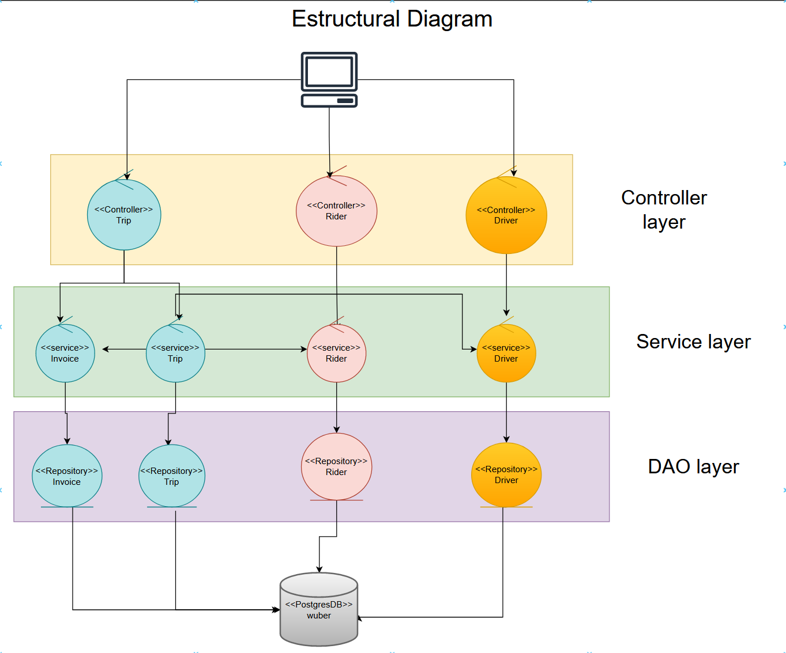
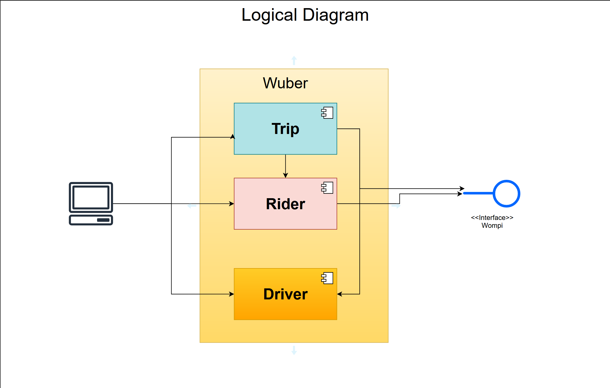
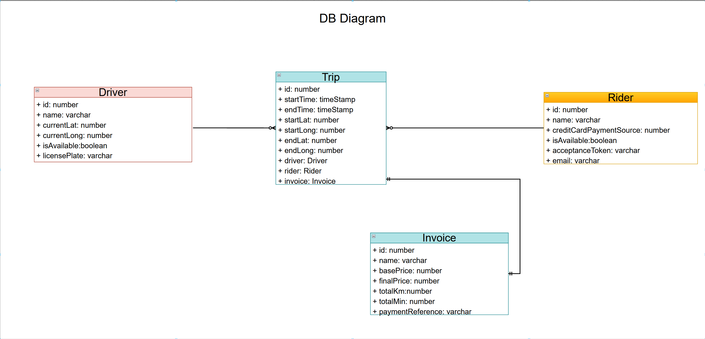

# Wuber

## Table of Contents
1. [Architecture](#Architecture)  
2. [Dependencies](#Dependencies)  
3. [Local development](#Local-development)
4. [Docker development](#Docker-development)
5. [Populate DB](#Populate-DB)
6. [Endpoints](#Endpoints)

## Architecture
#### Structural Diagram

#### Logical Diagram

#### DB Diagram


## Dependencies
*   @nestjs/common
*   @nestjs/config
*   @nestjs/core
*   @nestjs/platform-express
*   @nestjs/swagger
*   @nestjs/typeorm
*   axios
*   class-transformer
*   class-validator
*   pg
*   reflect-metadata
*   rxjs
*   typeorm

## Pre-requirements

* You must have a .env file. (There is a template in mockEnvFile)
* You must have docker installed.
* You must have a wompi account. (with the sandbox private key and public key)

## Local-development

For running the project local follow this steps:<br/>
*NOTE: If you run this locally you will have to change the template of the postgresql url to your local db*

#### Installation
```bash
$ npm install
```

#### Running the app

```bash
# development
$ npm run start

# watch mode
$ npm run start:dev

# production mode
$ npm run start:prod
```

#### Test

```bash
# unit tests
$ npm run test

# watch mode
$ npm run test:wathc
```
## Docker-development

For running the project on a doceker follow this steps:

#### Running the app

```bash
$ docker-compose up -d --build
```

#### Test
*NOTE For testing you will have to go to the docker compose.yml file and set the line 7 (target) to testing.*
```bash
$ docker-compose up --build
```

## Populate-DB

For populating the drivers and riders there are two `post` endpoints.

### Drivers
```
http://localhost:3000/drivers/populate
```
### Rider
*Note: You can send two optional arrays for populating the riders with the payment info. If the arrays are empty, you can later create the payment source.*
```
http://localhost:3000/riders/populate
payload = {
    "acceptanceTokens" : ["token"],
    "creditCardPaymentSources": [123456]
}
```

## Endpoints
The documentation for the endpoints is on swagger at `http://localhost:3000/api`. If you want to test the endpoints there is a postman collection in the file `Wuber.postman_collection.json`
